# Vue JS 3 Tutorial for Beginners #1 - Introduction
* https://youtu.be/YrxBCBibVo0?si=HF1CNL2BGZiA01Br

# What is Vue?
- Front-end, JavaScript / TypeScript framework
- Used to create dynamic & data-driven websites (SPA's)
- Can also be used to create stand-alone widgets

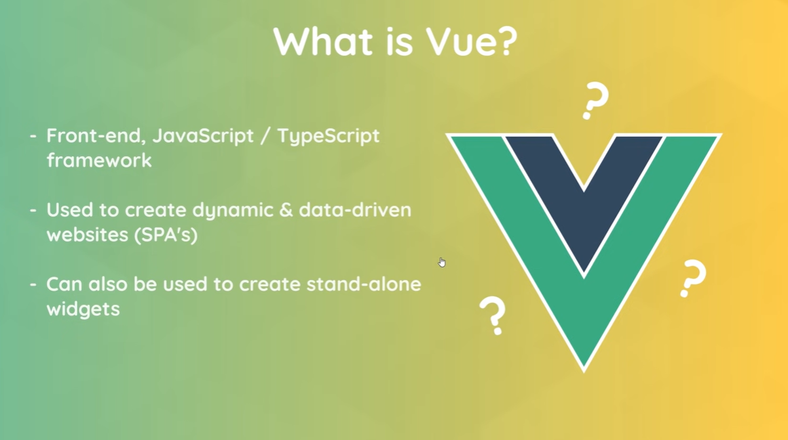

# Vue widgets

# Vue websites

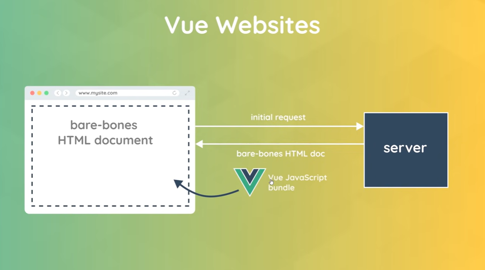

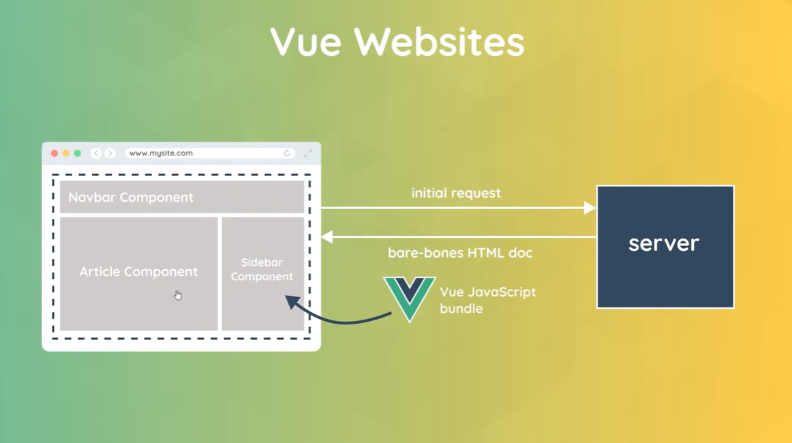

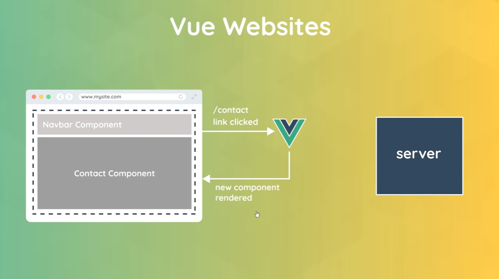

# Single Page Application

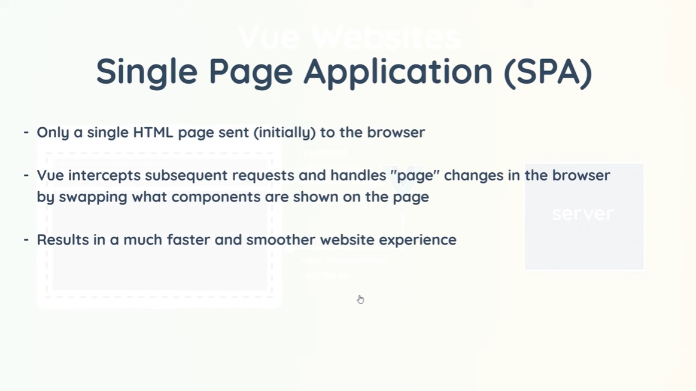

# Vue 3 New Features

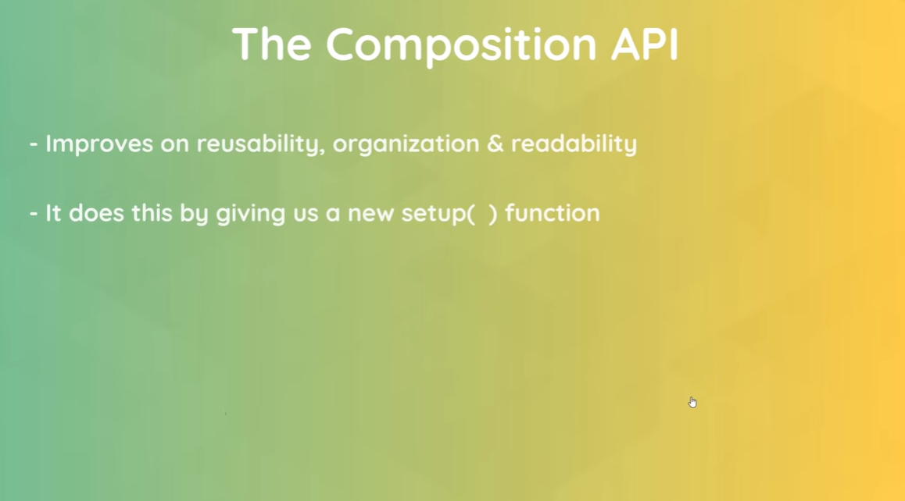

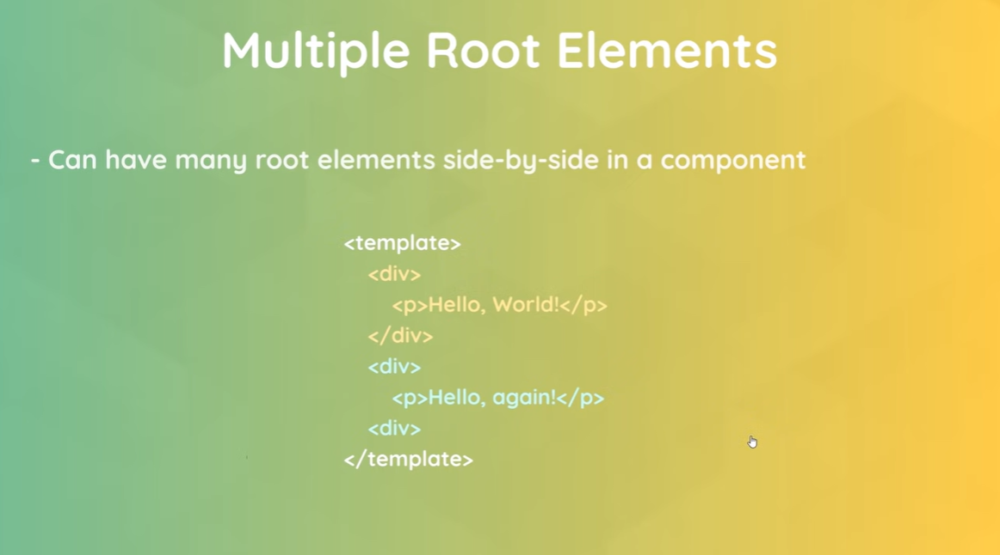

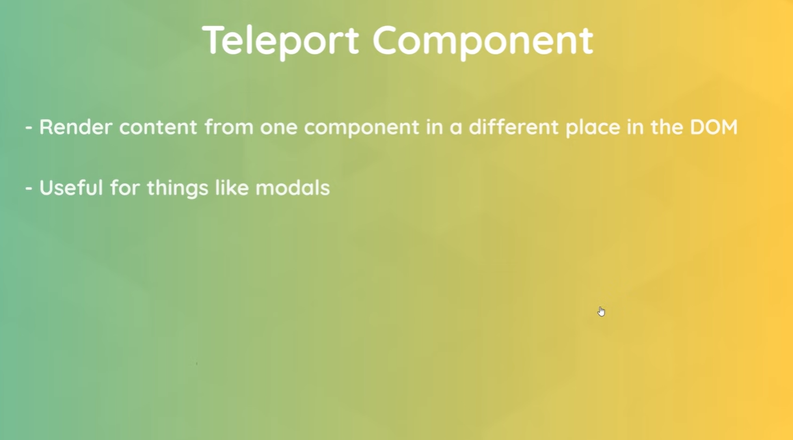

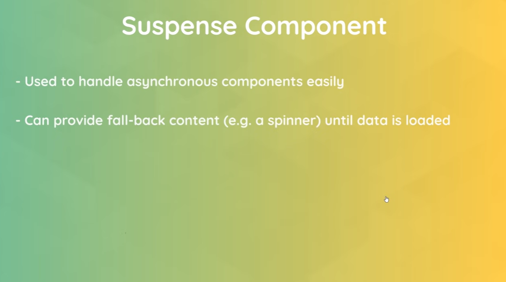

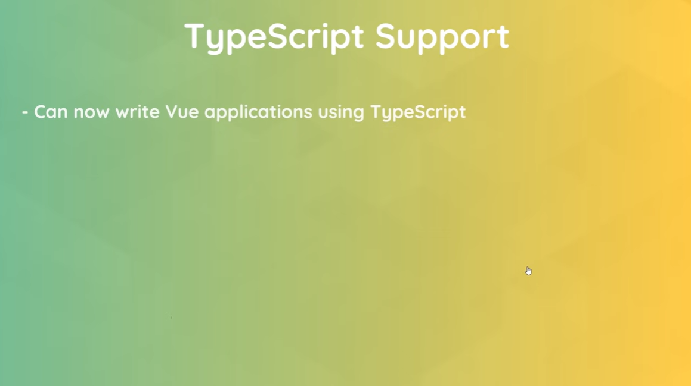

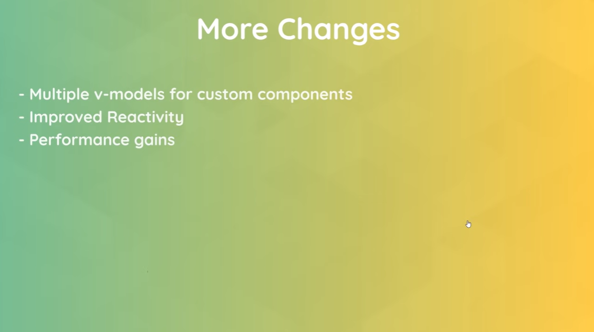

# Environment Setup
* Install VS Code
* Install the Live-Server extension