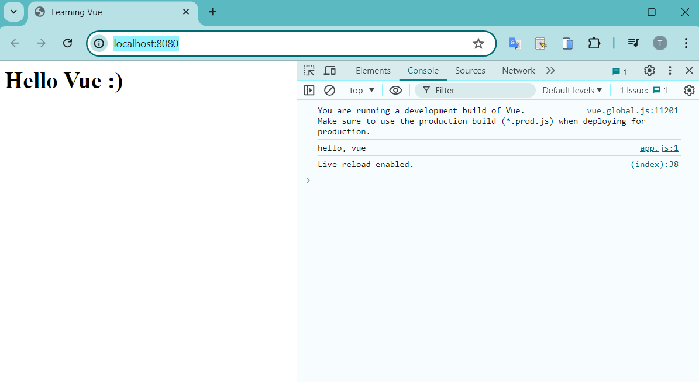
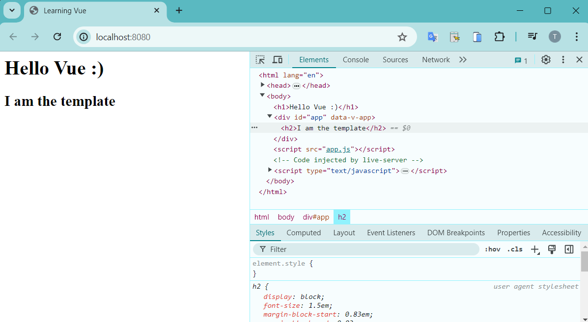
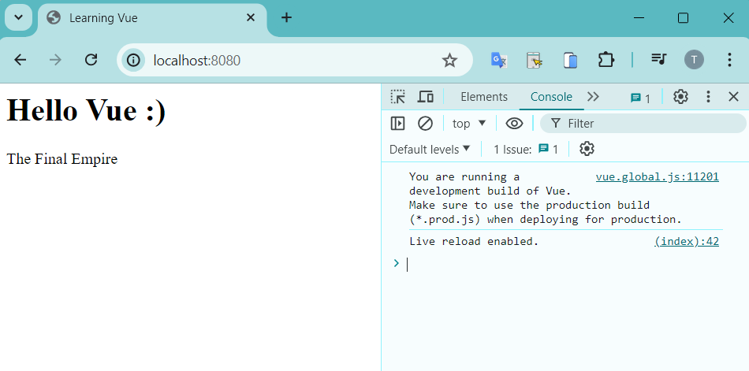
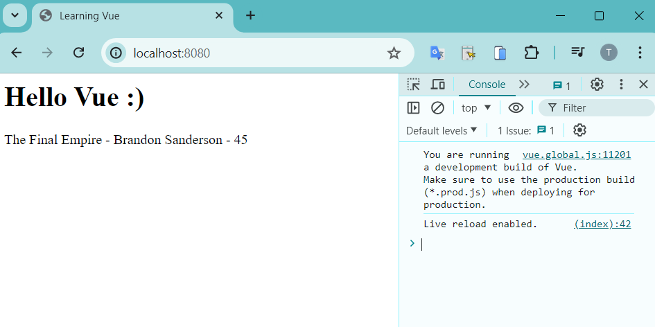
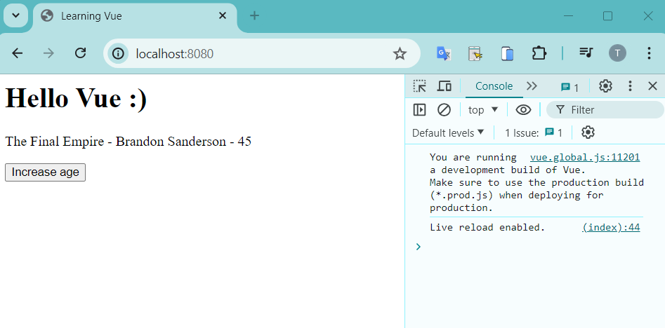
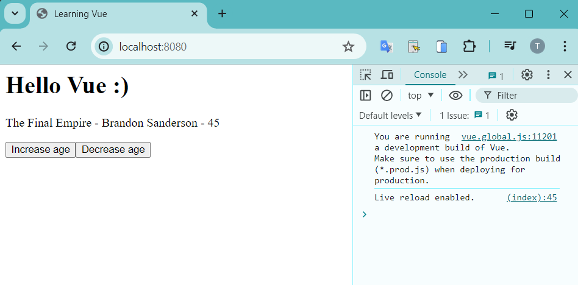
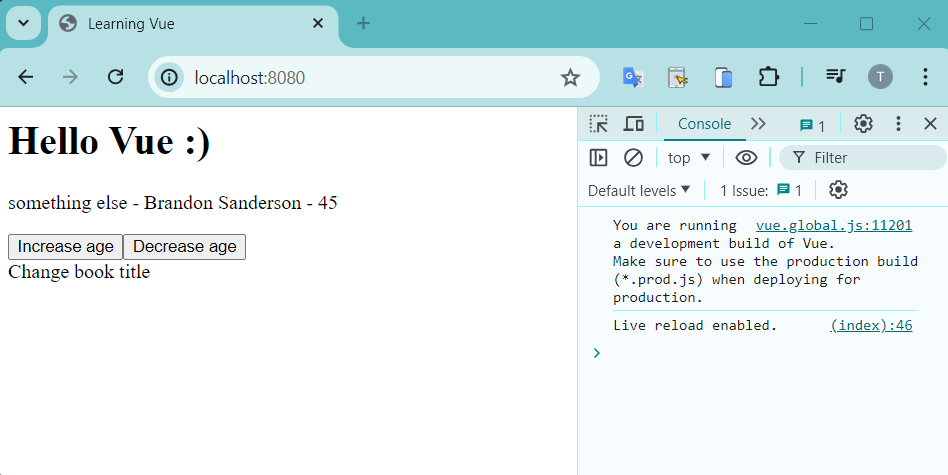
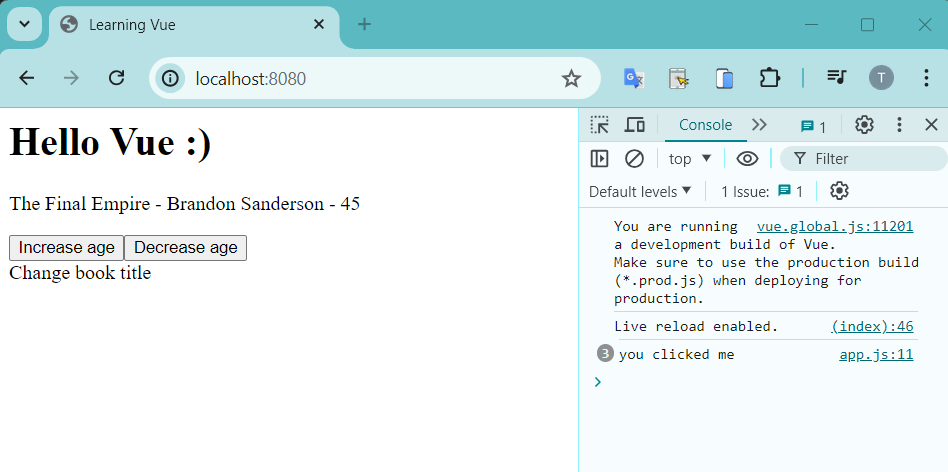
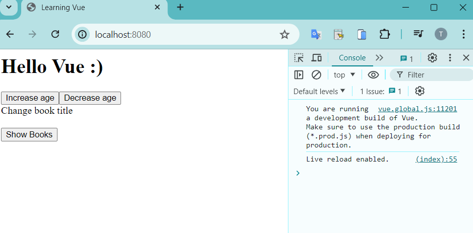

# Vue JS 3 Tutorial for Beginners #2 - Vue.js Basics (part 1)
* https://youtu.be/F7PLPJqVotk?si=BTtjKpUEh_B0yGLK

# VueJS Docs - Getting Started
* https://vuejs.org/guide/quick-start.html

# VueJS 3 - CDN

Add this line before the `</head>` tag to `index.html` file
```js
<script src="https://unpkg.com/vue@3/dist/vue.global.js"></script>
```

Create `app.js` with content:
```js
console.log('hello, vue');
```

And append this line before `</body>` tag to `index.html` file
```js
<script src="app.js"></script>
```

Here is the full HTML content of `index.html` file
```html
<html lang="en">
<head>
    <meta charset="UTF-8">
    <meta name="viewport" content="width=device-width, initial-scale=1.0">
    <title>Learning Vue</title>
    <script src="https://unpkg.com/vue@3/dist/vue.global.js"></script>
</head>
<body>
    <h1>Hello Vue :)</h1>

    <script src="app.js"></script>
</body>
</html>
```

Run `live-server` for serving static `index.html` file
```
$ live-server
```

Access the URL for testing
```
http://localhost:8080/
```




# Creating a Vue app

Change the content of `app.js` as follow:
```js
const app = Vue.createApp({
    // data, functions
    template: '<h2>I am the template</h2>'
})

app.mount('#app')
```

And the `index.html` as follow
```html
<html lang="en">
<head>
    <meta charset="UTF-8">
    <meta name="viewport" content="width=device-width, initial-scale=1.0">
    <title>Learning Vue</title>
    <script src="https://unpkg.com/vue@3/dist/vue.global.js"></script>
</head>
<body>
    <h1>Hello Vue :)</h1>

    <div id="app"></div>
    
    <script src="app.js"></script>
</body>
</html>
```




# Data & Templates

Will show how to use Dynamic variable. First, the `data()` function in the `app.js` file
```js
const app = Vue.createApp({
    data() {
        return {
            title: 'The Final Empire',
        }
    }
})

app.mount('#app')
```

Then in the `index.html` it will bind the `title` variable value:
```html
    <div id="app">
        <p> {{ title }}</p>
    </div>

    <script src="app.js"></script>
```



Now you can add more variable to the object
```js
const app = Vue.createApp({
    data() {
        return {
            title: 'The Final Empire',
            author: 'Brandon Sanderson',
            age: 45
        }
    }
})
```

And we render more variables
```html
    <div id="app">
        <p> {{ title }} - {{ author }} - {{ age }}</p>
    </div>
```



# Click Events

Create a button, and use the directive `v-on`, meaning on click or on mounted.
```html
    <div id="app">
        <p> {{ title }} - {{ author }} - {{ age }}</p>      
        
        <button v-on:click="age++">Increase age</button>
    </div>
```

Now you can increase your age by clicking on the button



Continue, we add more button to decrease the age:
```html
    <div id="app">
        <p> {{ title }} - {{ author }} - {{ age }}</p>      
        
        <button v-on:click="age++">Increase age</button>
        <button v-on:click="age--">Decrease age</button>
    </div>
```

Now you an increase your age or decrease your age by clicking on these buttons



You can replace the directive `v-on` with `@`, example:
```html
    <div id="app">
        <p> {{ title }} - {{ author }} - {{ age }}</p>      
        
        <button v-on:click="age++">Increase age</button>
        <button v-on:click="age--">Decrease age</button>
        <div @click="title = 'something else'">Change book title</div>
    </div>
```

Now you can click on the text `Change book title`, and you can see the title part will change to `something else`



We can create methods instead of inline code for these above events:
```js
const app = Vue.createApp({
    data() {
        return {
            title: 'The Final Empire',
            author: 'Brandon Sanderson',
            age: 45
        }
    },
    methods: {
        changeTitle() {
            console.log('you clicked me')
        }
    }
})
```

and you can call this `changeTitle` method from click event
```html
    <div id="app">
        <p> {{ title }} - {{ author }} - {{ age }}</p>      
        
        <button v-on:click="age++">Increase age</button>
        <button v-on:click="age--">Decrease age</button>
        <div @click="changeTitle()">Change book title</div>
    </div>
```

Now you can see the log output `you clicked me` in the console:



You can change the title variable by accessing `this.title` from the method
```js
    methods: {
        changeTitle() {
            this.title = 'Words of Randiance'
        }
    }
```


Now this is demo of passing parameter to the method
```html
    <div id="app">
        <p> {{ title }} - {{ author }} - {{ age }}</p>      

        <div @click="changeTitle('Oauthbringer')">Change book title</div>
    </div>
```
Add the `title` parameter to the method
```js
    methods: {
        changeTitle(title) {
            // this.title = 'Words of Randiance'
            this.title = title
        }
    }
```


# Conditional Rendering

Using directive `v-if` and `v-else` to control conditional readering
```html
    <div id="app">
        <div v-if="showBooks">
            <p> {{ title }} - {{ author }} - {{ age }}</p>      
        </div>

        <button @click="toggleShowBooks">
            <span v-if="showBooks">Hide Books</span>
            <span v-if="!showBooks">Show Books</span>
        </button>
    </div>
```
and the JS method
```js
    methods: {        
        toggleShowBooks() {
            this.showBooks = !this.showBooks
        }
    }
```

