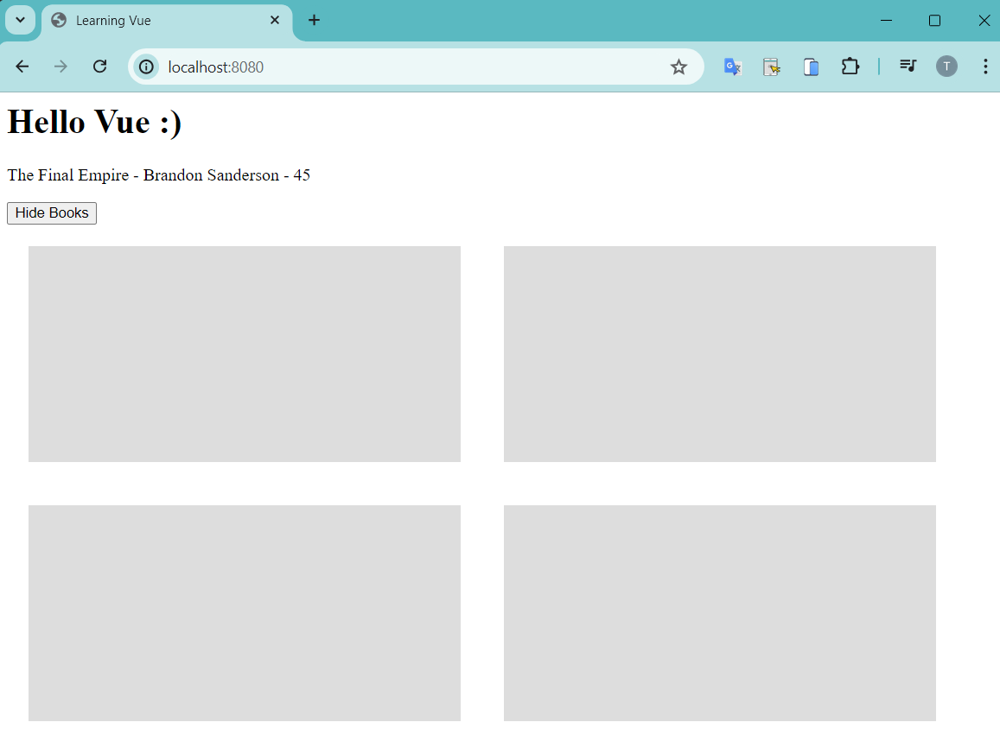
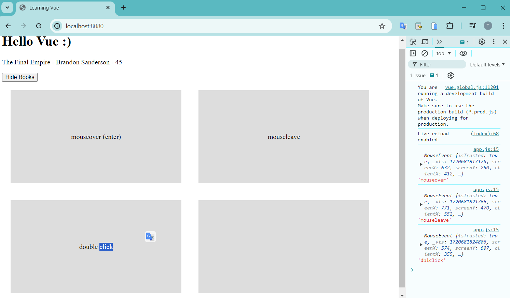
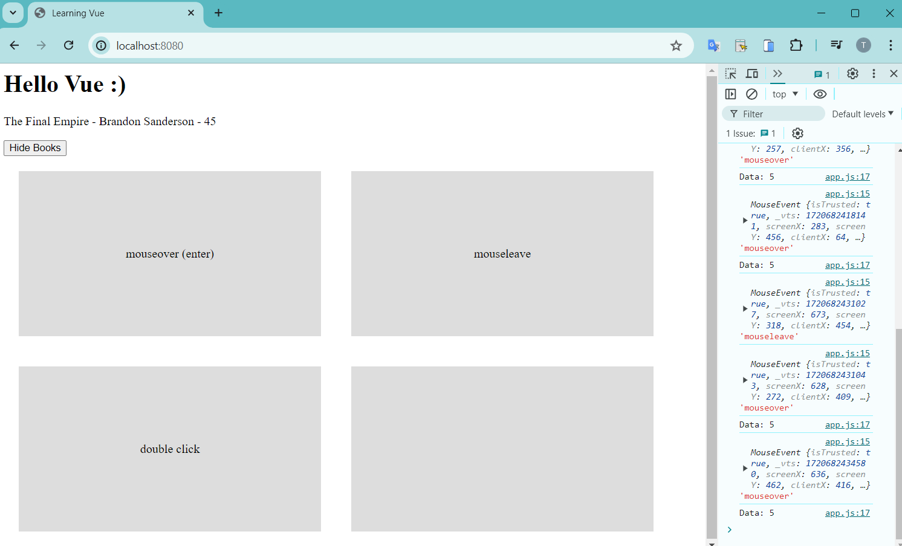

# Vue JS 3 Tutorial for Beginners #3 - Vue.js Basics (part 2)
* https://youtu.be/CYPZBK8zUik?si=OqvnphNAwoDli7aG

Will investigate more events: mouse hover, mouse click , ....

# Mouse Event

Add 4 div with class `box`:
```html
    <div id="app">
                
        <!-- mouse events-->
        <div class="box"></div>
        <div class="box"></div>
        <div class="box"></div>
        <div class="box"></div>

    </div>
```

And define inline style on HEAD tag
```html
<head>    
    <style>
        .box {
            padding: 100px 0;
            width: 400px;
            text-align: center;
            background: #ddd;
            margin: 20px;
            display: inline-block;
        }
    </style>
</head>
```

Now you should see 4 blocks



Adding some text and mouse to these blocks
* Ref: [Some Useful HTML Character Entities](https://www.w3schools.com/html/html_entities.asp#:~:text=To%20add%20real%20spaces%20to,use%20the%20character%20entity.)
```html
        <!-- mouse events-->
        <div class="box" @mouseover="handleEvent">mouseover (enter)</div>
        <div class="box" @mouseleave="handleEvent">mouseleave</div>
        <div class="box" @dblclick="handleEvent">double click</div>
        <div class="box">&nbsp</div>
```

Capture mouse events in the method
```js
    methods: {        
        handleEvent(e) {
            console.log(e, e.type)
        }
    }
```



You can see the MouseEvent type is shown in the Console. To explicit the event object to be passed to `handleEvent` method, let use `$event`
```html
<div class="box" @mouseover="handleEvent($event, 5)">mouseover (enter)</div>
```

And JS code
```js
    methods: {                
        handleEvent(e, data) {
            console.log(e, e.type)
            if (data) {
                console.log(data)
            }
        }
    }
```



